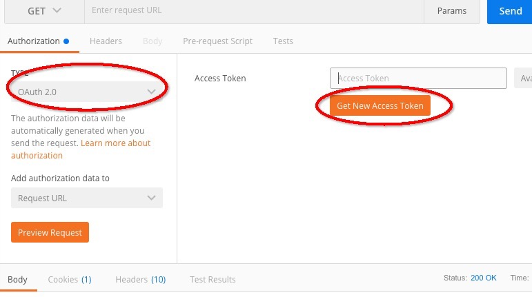
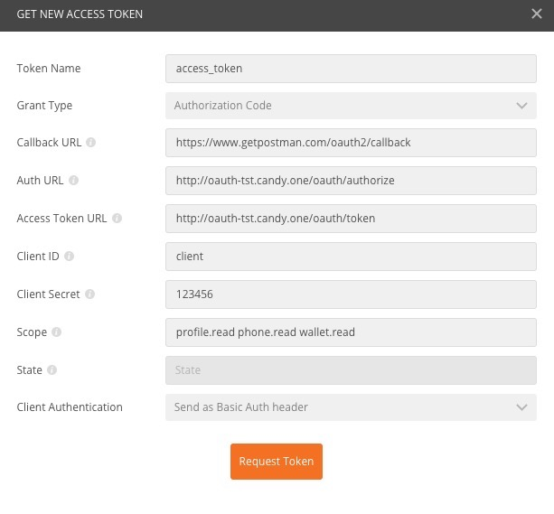
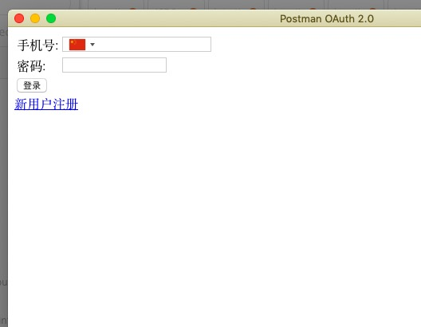
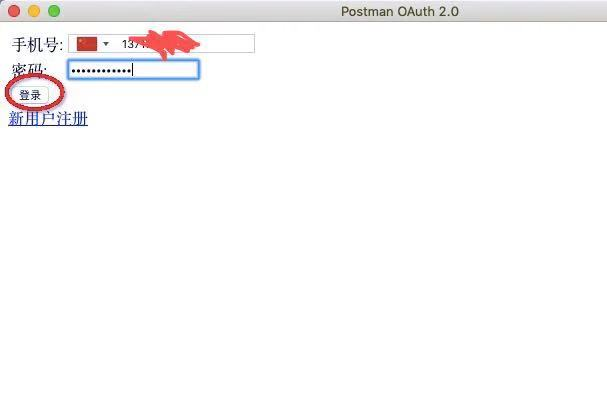
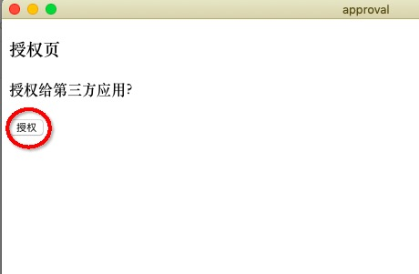
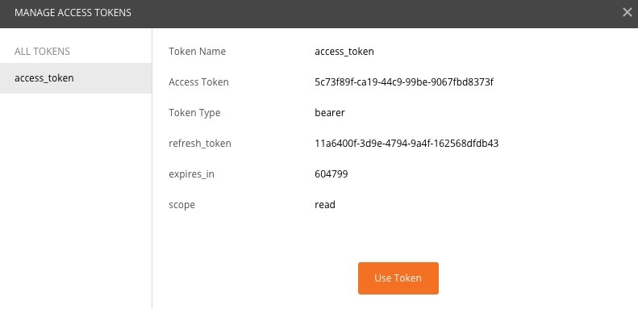

# 开放平台接口文档

## oauth2授权
### 概要介绍
  授权部分采用业界主流的oauth2协议授权码模式，具体概念介绍可以参考[oauth2介绍](http://www.ruanyifeng.com/blog/2014/05/oauth_2_0.html)  
### 第三方对接步骤
  下面以postman为例，介绍第三方对接我方授权平台的步骤。  
  
  1.选择postman的Authorization的选项，type选择Oauth 2.0,点击Get New Access Token   
  2.在新窗口中填入各个选项，点击request token  
  ### 标题2
姓名|技能|排行
--|:--:|--:
刘备|哭|大哥
关羽|打|二哥
张飞|骂|三弟
  上图中scope的说明如下  
名称|权限|功能  
--|:--:|--:  
profile.read|读|获取用户基本信息  
phone.read|读|获取用户拓展信息  
wallet.read|读|获取用户钱包信息  
  3.输入在我方平台已经注册的手机号密码，点击登录    
  4.跳转到授权确认页面，点击授权   
  5.跳转到显示token页面，授权过程结束   

  
## 获取授权用户基本信息
### 概要介绍
  授权成功后，第三方平台可以根据用户的token获取用户的基本信息，比如open_id,头像，昵称等。
### 调用方法  
  [用户基本信息](user_info.md)  
  [用户完整信息](user_info_ext.md)
